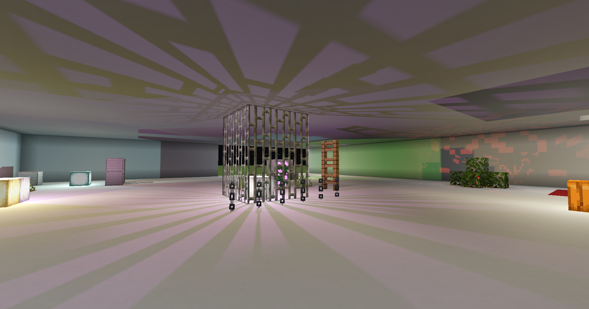

# Point Shadow Sample
A sample shader pack for implementing point-light shadow maps, using the new Aperture pipeline from Iris.

## How it Works
The Point-Light manager is enabled when the shader defines a `RendererConfig.pointLight.maxCount` above zero, and is disabled by default. It scans an 8x6x8 region of sections for lights, where each section is 16x16x16 blocks. All lights are "static" by default, and only render once at the time they become active.

A limited number of "real-time" lights can be enabled via `RendererConfig.pointLight.realTimeCount`, which allows the nearest "N" lights to include entity shadows and be updated every frame. This can be expensive for performance so should be kept limited. You can also enable `RendererConfig.pointLight.cacheRealTimeTerrain` which will only render entities every frame, over a cached depth map of terrain.

### Other options
- `RendererConfig.pointLight.resolution`: Sets the resolution (per-face) for all point-light shadow maps.
- `RendererConfig.pointLight.maxUpdates`: The maximum number of shadow maps that can be rendered/updated per-frame. Helps avoid stutters when many lights change state.
- `RendererConfig.pointLight.updateThreshold`: The threshold (as a percentage) that is required for an active light to be replaced with a pending light. Higher values will provide more stable lighting by reducing changes in active vs pending lights; lower values will provide more frequent/immediate updates.
- `RendererConfig.pointLight.nearPlane`: The near-plane for point-light depth maps. Set to `0.1` for a light diameter of `0.2` blocks.
- `RendererConfig.pointLight.farPlane`: The far-plane for point-light depth maps. Set to `16` for vanilla lighting, but you may want to increase for more realistic usages.

## Light Lists
Directly sampling [up to] 256 lights for every pixel will quickly ruin performance. For supporting larger light counts it is highly suggested you add localized light lists/bins for reducing the number of lights sampled per-pixel. An example of this is included, using 3 compute passes.

- `light-list-clear`  
Resets the counter for each light bin to zero. The array of light indices does not need to be cleared, it will just get overwritten.

- `light-list`  
Dispatches a thread for every light in the "global" light list SSBO. The position of the light is used to find the respective "local bin", and appends the index of that light to that bin using an atomic counter. Skip any "undefined"/empty lights where block ID is "none".

- `light-list-neighbors`  
Dispatches a thread for every local light bin. For every light in the current bin, find any neighboring bins it can reach, and if it does than append the light index to that neighbors bin.

This allows you to sample the "local bin" which typically has far fewer lights than the global list.

## License/Usage
### You may:
- use any and all code in this example for your own projects; including for-profit works.

### You may NOT:
- directly redistribute this example as your own work.
